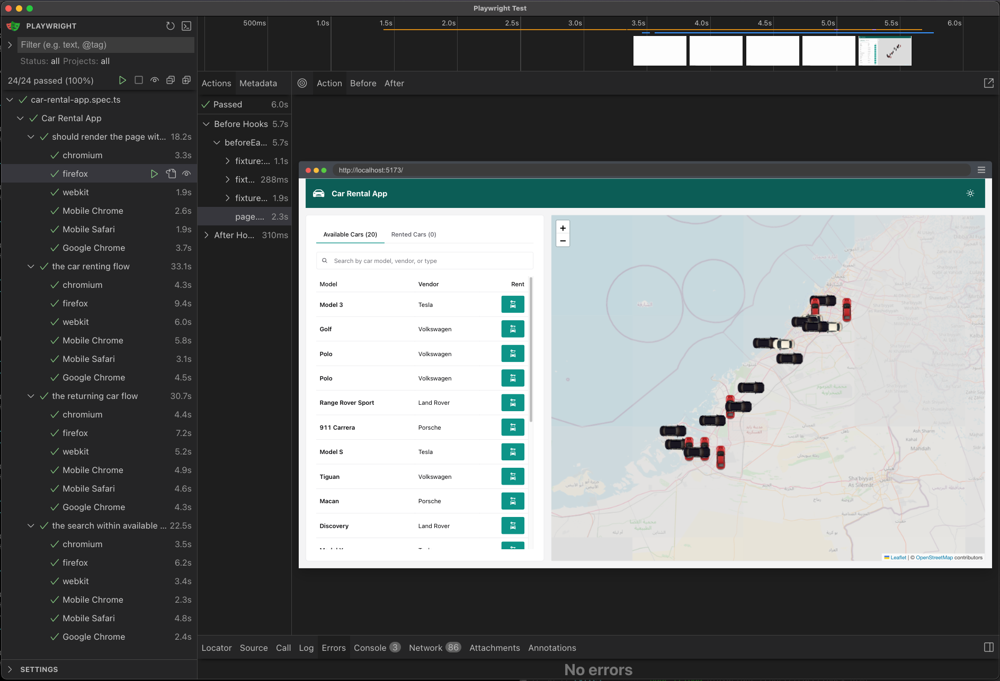
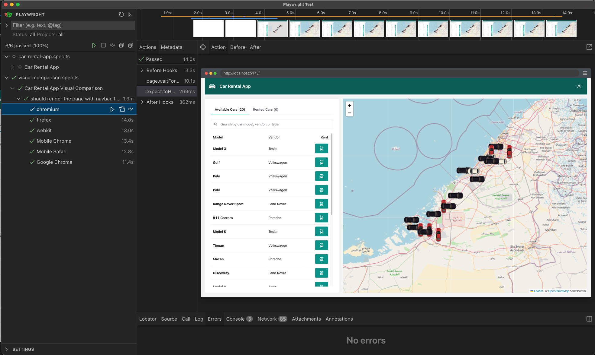
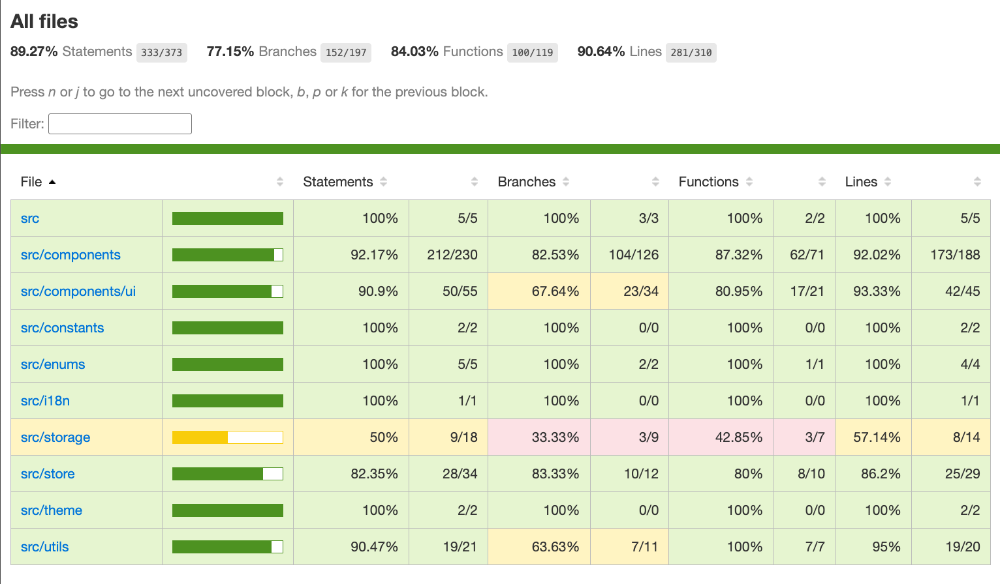

# Car Rental App

This project is built with [React](https://reactjs.org/) and [TypeScript](https://www.typescriptlang.org/), and was bootstrapped using [Vite](https://vitejs.dev/).

---

### 📘 User Guide

- [View User Guide (PDF)](docs/user-guide.pdf)

### 🔶 Activity Diagram

- [View Activity Diagram (PNG)](docs/activity-diagram.png)

---

### 🚀 Getting Started

Follow the steps below to run the app locally:

#### 🐳 Option 1: Run with Docker

Note: Docker is required to run the app in a containerized environment. Tested with Docker version 28.0.4

```bash
git clone https://github.com/croiden/car-rental-app.git
cd car-rental-app
docker compose up --build

```

Once the build completes, the app will be available at:
👉 http://localhost:8081

#### 🧑‍💻 Option 2: Run with Node.js

Note: Node.js v22.14.0 or higher is required.
[Optional] Use nvm to install and manage the Node version.

```bash
# Clone the repo
git clone https://github.com/croiden/car-rental-app.git
cd car-rental-app

# Install dependencies
npm install

# Start the development server
npm run dev
```

### 📦 Available Scripts

In the project directory, you can run:

- `npm run build` – Builds the app for production to the dist folder.

- `npm run preview` – Previews the production build.

- `npm run lint` – Lints the code using ESLint.

- `npm run test` – Runs tests using Playwright.

- `npm run test:ui` – Runs Playwright tests in UI mode.

- `npm run test:coverage` – Runs Playwright tests and generates a coverage report.

### 🛠 Tech Stack

- [React](https://reactjs.org/) - A JavaScript library for building user interfaces.
- [TypeScript](https://www.typescriptlang.org/) - A superset of JavaScript that compiles to clean JavaScript output.
- [Vite](https://vitejs.dev/) - A fast build tool and development server.
- [Chakra UI](https://chakra-ui.com/) - A simple, modular, and accessible component library for React.
- [zustand](https://zustand-demo.pmnd.rs/) - A small, fast, and scalable bearbones state-management solution.
- [React i18next](https://react.i18next.com/) - Internationalization for React done right.
- [React Leaflet](https://react-leaflet.js.org/) - React components for Leaflet maps.
- [Playwright](https://playwright.dev/) - A Node.js library to automate Chromium, Firefox, and WebKit with a single API.
- [Docker](https://www.docker.com/) - A platform for developing, shipping, and running applications in containers.

## ✅ Test Results

### 📈 Playwright Test Summary



### 🖼️ Visual Snapshot Comparisons



### 📊 Code Coverage



### Suggested Improvements:
Here are a few enhancements that can be made to improve the codebase and user experience:

Car List View:

- Implement Pagination or Infinite Scroll: Improve performance by loading cars in chunks, especially when handling a large dataset.
- Add Sorting Options: Enable sorting by parameters such as model, vendor, booked by, and booking time to enhance user navigation and usability.

Search Functionality:

- Autocomplete Suggestions: As the user types in the search bar, display a dropdown with matching results. This improves discoverability and reduces typing effort.

Return Car Flow:

- Add Search Dropdown for Return Location: In addition to map-based selection, offer a search dropdown for users to quickly find and select their return location. This assists users who may not be comfortable using the map.

## Below README content was auto generated during the template creation process:

# React + TypeScript + Vite

This template provides a minimal setup to get React working in Vite with HMR and some ESLint rules.

Currently, two official plugins are available:

- [@vitejs/plugin-react](https://github.com/vitejs/vite-plugin-react/blob/main/packages/plugin-react/README.md) uses [Babel](https://babeljs.io/) for Fast Refresh
- [@vitejs/plugin-react-swc](https://github.com/vitejs/vite-plugin-react-swc) uses [SWC](https://swc.rs/) for Fast Refresh

## Expanding the ESLint configuration

If you are developing a production application, we recommend updating the configuration to enable type-aware lint rules:

```js
export default tseslint.config({
   extends: [
      // Remove ...tseslint.configs.recommended and replace with this
      ...tseslint.configs.recommendedTypeChecked,
      // Alternatively, use this for stricter rules
      ...tseslint.configs.strictTypeChecked,
      // Optionally, add this for stylistic rules
      ...tseslint.configs.stylisticTypeChecked,
   ],
   languageOptions: {
      // other options...
      parserOptions: {
         project: ['./tsconfig.node.json', './tsconfig.app.json'],
         tsconfigRootDir: import.meta.dirname,
      },
   },
})
```

You can also install [eslint-plugin-react-x](https://github.com/Rel1cx/eslint-react/tree/main/packages/plugins/eslint-plugin-react-x) and [eslint-plugin-react-dom](https://github.com/Rel1cx/eslint-react/tree/main/packages/plugins/eslint-plugin-react-dom) for React-specific lint rules:

```js
// eslint.config.js
import reactX from 'eslint-plugin-react-x'
import reactDom from 'eslint-plugin-react-dom'

export default tseslint.config({
   plugins: {
      // Add the react-x and react-dom plugins
      'react-x': reactX,
      'react-dom': reactDom,
   },
   rules: {
      // other rules...
      // Enable its recommended typescript rules
      ...reactX.configs['recommended-typescript'].rules,
      ...reactDom.configs.recommended.rules,
   },
})
```
